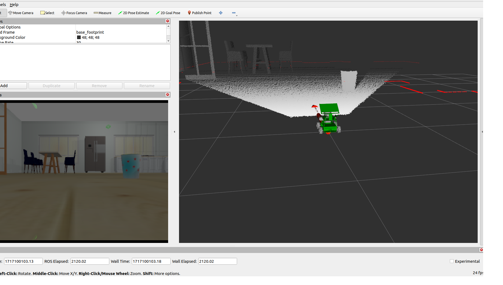

# Introduction

This is a project to lear robotics concepts with an simulated robot which is based on the rosmaster X3 robot.

## Overview

This repository provides a robot description and a simulation environment as playground for robotics experiments.

One result is the simulation of a rosmaster X3 robot in a gazebo simulation world.



## Prerequisites

* Installed ROS 2 humble distribution
* Installed gazebo harmonic distribution
* Setting *export GZ_VERSION=harmonic* (best in bashrc) to define target gazebo version

## Installation

First install required development tools

``` bash
sudo apt install python3-vcstool python3-colcon-common-extensions git wget
```

Then create a new workspace and load the git repositories which are required.

``` bash
mkdir -p ~/master3_ws/src
cd ~/master3_ws/src
wget https://raw.githubusercontent.com/cord-burmeister/master3/main/master3.yaml
vcs import < master3.yaml
```

### Install dependencies

``` bash
cd ~/master3_ws
source /opt/ros/$ROS_DISTRO/setup.bash
sudo rosdep init
rosdep update
rosdep install --from-paths src --ignore-src -r -i -y --rosdistro $ROS_DISTRO
```

### Build the project

``` bash
colcon build 
```

### Source the workspace

``` bash
. ~/master3_ws/install/setup.sh
```

## Starting commands

### Display XACRO robot description

There is a launch file which is starting the **RViz2** application to view the URDF model.

``` bash
ros2 launch master3_description display_Xacro.launch.py
```

### Adding keyboard teleoperation

One of the first possibilities to control a definitions of a robot is to operate it remotely with a teleoperation. There is a package which converts console input into twist messages. Note that the command with the default topic will be mapped to the robot topic.

``` bash
ros2 run  teleop_twist_keyboard teleop_twist_keyboard --ros-args --remap cmd_vel:=master3_drive/cmd_vel
```

### Adding teleoperation with X-Box One S pad

``` bash
ros2 launch master3_teleop joystick_xbox.launch.py 
```

### Navigate the small house environment

This opens the gazebo without robot.

``` bash
ros2 launch aws_robomaker_small_house_world small_house.launch.py gui:=true
```

### Starting the simulation environment

This opens the *gazebo* together with the *RViz2* with the spawned robot.

``` bash
ros2 launch master3_bringup master3_house.launch.py
```

### Starting the simulation environment and the navigation

<!-- ``` bash
ros2 launch master3_nav2 master3_navigate.launch.py headless:=True
``` -->


``` bash
ros2 launch master3_nav2 master3_navigate_slam.launch.py headless:=False
```

### Exploring and generate a map

``` bash
ros2 launch explore_lite explore.launch.py use_sim_time:=True
```


## References

[What is vcstool?](https://github.com/dirk-thomas/vcstool)
